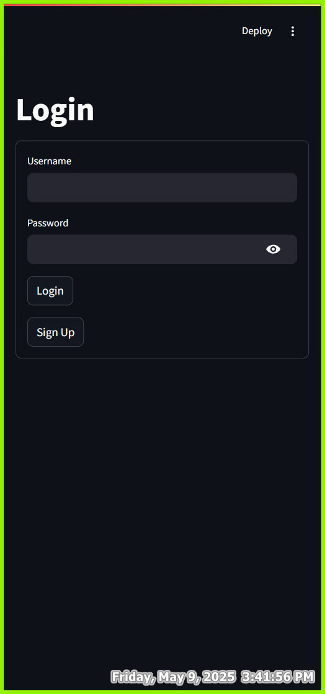

# WSP Grad Project

# Team Members:

- [x] 1. [Islam Ali]
- [x] 2. [Peter Magdy Gamil]
- [x] 3. [Mostafa Saad]
- [x] 4. [Esraa Kamel]
- [x] 5. [Mohamed Khaled]
- [ ] [no contribute] 6. [Mahmoud Mohamed Elebiare]
- [ ] [no contribute] 7. [Mohamed Alaa Eldin Fouad Ahmed Mansour]

# System Architecture

## Authentication System
The project implements a secure authentication system using FastAPI for the backend and SQLite for the database. Here's how it works:

### Database Structure
We use SQLite to store user data and activity logs in two main tables:

1. **Users Table**:
   - `user_id`: Unique identifier for each user
   - `username`: Unique username
   - `password_hashed`: SHA-256 hashed password
   - `registration_date`: Timestamp of user registration

2. **Activity Logs Table**:
   - `log_id`: Unique identifier for each activity
   - `user_id`: References the user who performed the action
   - `action`: Type of action (e.g., login, registration)
   - `timestamp`: When the action occurred

### Security Features
- Password hashing using SHA-256
- Activity logging for user actions
- Token-based authentication for API endpoints
- Session management for frontend

## User Interface

### Login Page

The login page provides a secure entry point to the application. Users can enter their credentials which are verified against the hashed passwords in the database.

### Sign Up Page

New users can create an account through the sign-up page. The system validates the input and securely stores the credentials.

### Main Dashboard

After successful authentication, users are presented with the main dashboard where they can access the application's features.

# How to contribute
1. Fork the repository 
```bash
git clone https://github.com/Islam29632/WSP_Grad_Project.git
```
2. install dependencies
```bash
pip install -r requirements.txt
```
3. Make your changes
4. Commit your changes
```bash
git add .
git commit -m "your message"
```
5. Push 
```bash
git push
```

# Running the Application

1. Start the API server first from the project root directory
```bash
uvicorn main:app
```
The API server will start on http://localhost:8000

2. Start the Streamlit app from the frontend directory
```bash
streamlit run app.py
```
The Streamlit app will be available at http://localhost:8501

Note: Make sure to start the API server before running the Streamlit app, as the frontend depends on the API being available.

# Technical Documentation

For detailed technical documentation about the authentication system, database structure, API endpoints, and security features, please refer to:
- [Database & Authentication Documentation](backend/database/README.md)

# Check `TODO.md` file for tasks.
